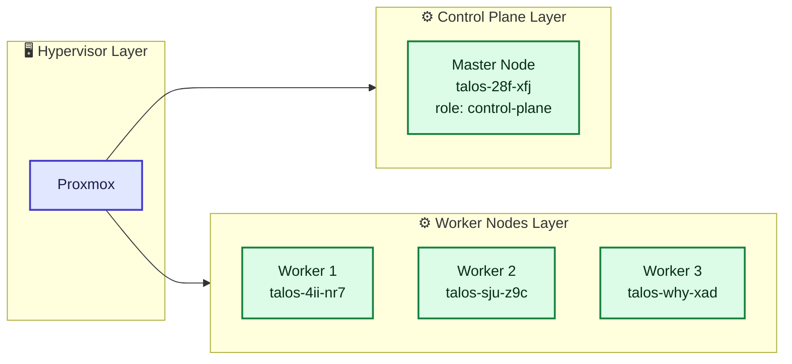
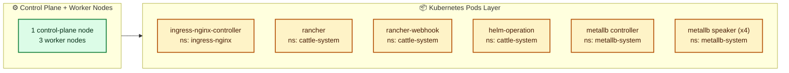
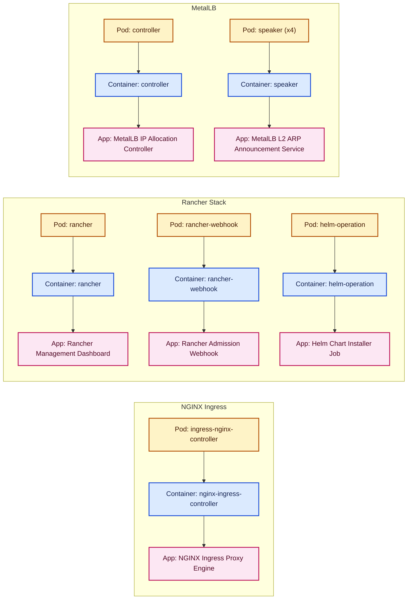
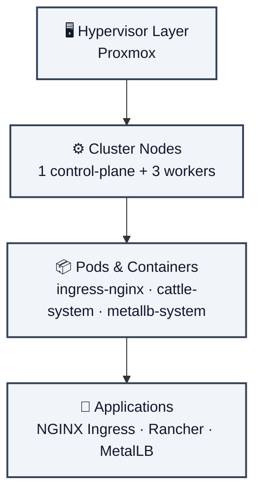
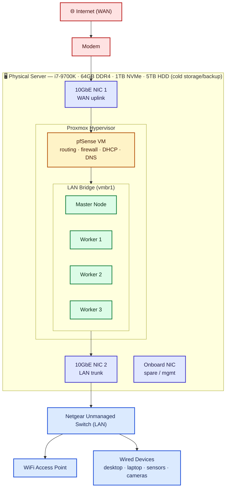
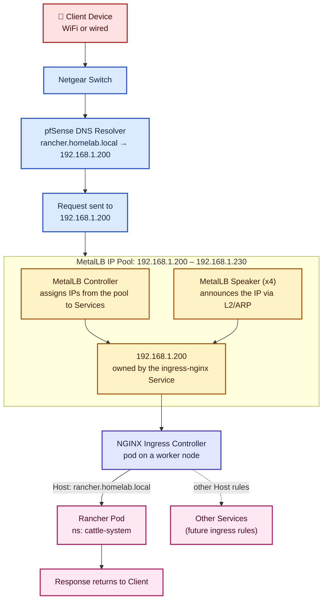

# Talos Homelab

## Architecture

This stack has six layers, and each one only makes sense in terms of the layer below it. Rather than trying to take in all six at once, here's each layer paired with the one it produces, followed by a single diagram that ties the whole thing together.

### Layer 1 → 2: Hypervisor to Nodes

Proxmox is the physical hypervisor. It carves out four VMs: one control-plane node and three worker nodes, all running Talos.



### Layer 2/3 → 4: Nodes to Pods

The control plane schedules work, and the three worker nodes actually run it. Together they host six kinds of pods, spread across the `ingress-nginx`, `cattle-system`, and `metallb-system` namespaces.



### Layer 4 → 5 → 6: Pods to Containers to Applications

Each pod runs one container, and each container is what actually delivers an application. Grouping these by the service they belong to makes the chain easier to follow than one long flat list:



### The Full Picture

Zoomed all the way out, the whole homelab is just five stacked layers (pods and containers collapse to a 1:1 relationship here, so they're combined):



### Glossary

- `proxmox` - A virtualization server managing vms and containers.
- `cluster` - A collection of connected physical or virtual machines which act as a single unit to run, scale, and manage containerized applications.
- `nodes` - Physical or virtual machines which are part of a cluster (in this case, they are virtual machines in proxmox).
- `control plane` - Nodes which act as configuration-based coordinators of worker nodes. The control plane contains a database for configuration objects of various kinds to be added, such as a `Deployment`, `Service`, or `ConfigMap`.
- `workers` - Nodes which accept work by the control plane. Pushing a new configuration object into the control plane with a `Deployment` consisting of `replicas: 3` will create 3 new pods across all of the available worker nodes. Any worker node could accept that work to spin up a new pod.
- `pod` - The smallest deployable computing unit that you can create and manage in Kubernetes. It represents a single instance of a running process in your cluster and houses one or more containers that share network and storage resources.
- `container` - A lightweight, standalone, executable software package that includes everything needed to run an application—code, runtime, system tools, libraries, and settings—keeping the application securely isolated from the host system environment.

## Network Topology

Zooming out from Kubernetes, here's the physical and network path traffic takes to even reach the cluster: from the internet, through the modem, into the single physical box that hosts everything (pfSense included), and out to the rest of the house.



The whole cluster and pfSense live on one physical box. One 10GbE NIC takes the WAN handoff straight into the pfSense VM; the second 10GbE NIC carries the LAN side back out to the Netgear switch, which fans out to the WiFi AP and wired devices. The onboard NIC is spare capacity for management if the 10GbE ports are ever busy. pfSense's LAN interface, the Talos VMs, and the physical LAN NIC all sit on the same Proxmox bridge (`vmbr1`), so pfSense is the router/firewall/DNS/DHCP for the whole network, not a hop every single packet has to pass through.

## Load Balancing & Ingress Traffic Flow

This picks up where the topology diagram leaves off: once a request is on the LAN, how does it actually find Rancher (or any other service) sitting behind MetalLB's `192.168.1.200–192.168.1.230` pool?



The load balancing happens in two places at once: MetalLB's controller hands `192.168.1.200` to the `ingress-nginx` Service and its speaker pods announce that address over ARP so the router can find it on the wire, and then NGINX itself does the second-stage routing — reading the `Host` header on the incoming request and forwarding it to whichever backend Service matches (Rancher today, anything else you add an ingress rule for later). That's why every new service you expose doesn't need its own IP from the pool: they can all share `192.168.1.200` and get load-balanced by hostname at the NGINX layer, while MetalLB only hands out a fresh address from the pool when a Service explicitly asks for its own `LoadBalancer` IP.

## Setting up the master node (control plane)

### Proxmox Setup

1) Downloaded `metal-amd64.iso` Talos disk image (v1.14.1)
2) Upload disk image to Proxmox
3) Create a new VM in Proxmox (refer to section below on hardware configuration) 
4) Create a new static ip assignment in your gateway using the mac address of the VM's network device
5) Insert the ISO and boot the VM
6) Use the console to verify that Talos has booted and is waiting for configuration

#### VM Hardware Configuration

**System**

Qemu Agent: `enabled`

Machine: `i440fx`

BIOS: `SeaBios`

SCSI Controller: `VirtIO SCSI`

**Disks**

Disk: `30G`

Discard: `enabled`

SSD Emulation: `enabled`

**CPU**

Sockets: `1`

Cores: `2`

Type: `host` (it's at the bottom of the list)

**Memory**

Size (MiB): `4096`

Ballooning Device: `disabled`

**Network**

Bridge: (select the appropriate network bridge to your NIC)

Model: `VirtIO (paravirtualized)`

Firewall: `enabled`

### Talos CTL Setup

1) Downloaded talosctl.exe release
2) Placed talosctl.exe in ~/bin/talosctl
3) Added ~/bin/talosctl to `$PATH`
4) Edited .bashrc and added entries: `export CONTROL_PLANE_IP="192.168.1.180"` and `export CLUSTER_NAME="starfleet"`
5) Restart bash

### Creating the project

1) mkdir `~/src/starfleet`
2) cd `~/src/starfleet`
3) `talosctl gen config starfleet https://192.168.1.180:6443`
4) `talosctl apply-config --insecure --nodes $CONTROL_PLANE_IP --file controlplane.yaml`
5) `talosctl --talosconfig=./talosconfig config endpoint $CONTROL_PLANE_IP`
6) `talosctl --talosconfig=./talosconfig config node $CONTROL_PLANE_IP`
7) `talosctl bootstrap --nodes $CONTROL_PLANE_IP --talosconfig=./talosconfig`
8) `talosctl kubeconfig --nodes $CONTROL_PLANE_IP --talosconfig=./talosconfig`
9) **Wait! It's going to take a few minutes before kubectl is going to work**
10) Run `kubectl get namespaces` to test if you are able to talk to the control plane
11) Remove the ISO from the VM
12) Shutdown the VM
13) Update the boot order in Options > Boot Order and select `scsi0`, otherwise you'll be trying to boot over `net0` in my case

## Setting up the worker nodes

I used the same hardware configuration except for a slightly smaller disk at `20G` instead of `30G` for the worker. 

Like the master node, I created a static ip address mapping for each workers' mac addresses. From here on out we can benefit from already having a `worker.yaml` to push to the workers.

After I have booted and the ISO is still in the worker node. Over on my remote machine I use to configure the worker, these are the commands I ran:

> Replace <WORKER_NODE_IP> with the IP of each worker you provision

`talosctl apply-config --insecure --nodes <WORKER_NODE_IP> --file worker.yaml`

That's it! Now once everything is good and `kubectl get nodes` is showing the worker nodes, you can shut down the workers, remove the ISO, and make sure that the boot order is set to boot `scsi0`. Then start the workers again.

## Applying Image Factory Upgrade

You can create a new Talos factory image here: [https://factory.talos.dev/](https://factory.talos.dev/)

If you used the Talos Image Factory to set up extra extensions, run this from your remote machine used to configure Talos for each node (master and workers, replace `<NODE_IP>` with the node IP of course):

> Keep in mind that I had to do this one node at a time. 
> When I tried upgrading several workers at one time I 
> ran into network congestion issues or some other 
> networking/availability related issue. Doing each 
> worker one node at a time yielded successful results.

```bash
talosctl upgrade --nodes <NODE_IP> \
    --talosconfig=./talosconfig \
    --image factory.talos.dev/installer/88d1f7a5c4f1d3aba7df787c448c1d3d008ed29cfb34af53fa0df4336a56040b:v1.14.1
```

These were the extensions I used for the URL you see above for version `v1.14.1`:
```
customization:
    systemExtensions:
        officialExtensions:
            - siderolabs/iscsi-tools
            - siderolabs/qemu-guest-agent
            - siderolabs/util-linux-tools
```

I'm pretty sure the ideal path is to perform the setup with the factory produced image, but I forgot to do that step so this is good documentation on upgrading. This is similar to the process of upgrading to new versions of Talos.

## Configuring Talos CTL Globally

To prevent having to pass your config around every time you run Talos CTL commands on your machine:

1) Create a talos user profile folder: `mkdir -p ~/.talos`
2) `cd <YOUR_TALOS_PROJECT_FOLDER>`
2) Copy to global: `cp ./talosconfig ~/.talos/config`

## Setting up Helm & Cert-Manager

> AI Warning:
> This section was autogenerated by Gemini Pro based on 
> a conversation I had with it about setting up rancher, helm,
> metallb, and an nginx ingress controller.

Since Talos is an immutable OS, we don't SSH into the VMs to install packages. Everything is deployed remotely from my machine using Helm. Before getting to the big stuff, I had to set up Helm and `cert-manager`, which Rancher needs to handle its TLS certificates.

1) Install Helm on your remote machine (if you don't have it already).
2) Add the required Helm repos:
    ```bash
    helm repo add jetstack [https://charts.jetstack.io](https://charts.jetstack.io)
    helm repo add rancher-latest [https://releases.rancher.com/server-charts/latest](https://releases.rancher.com/server-charts/latest)
    helm repo update
    ```
3) Install `cert-manager` into the cluster:
    ```bash
    helm install cert-manager jetstack/cert-manager \
      --namespace cert-manager \
      --create-namespace \
      --set crds.enabled=true
    ```

## Setting up MetalLB

> AI Warning:
> This section was autogenerated by Gemini Pro based on 
> a conversation I had with it about setting up rancher, helm,
> metallb, and an nginx ingress controller.

Talos provides a very bare-bones Kubernetes foundation, meaning it doesn't come with a load balancer. If we want our services to get a consistent static IP on the home network, we need MetalLB. 

> **Important Hitch!** 
> Proxmox has an anti-spoofing firewall enabled by default on VM network interfaces. When MetalLB tries to broadcast its IP via ARP, Proxmox will drop the packets, and you won't be able to ping your load balancer IP. Go to the Hardware tab in Proxmox, double-click the Network Device (net0) for every single node (master and workers), and **uncheck the Firewall box**. 

1) Apply the native MetalLB manifest directly:
    ```bash
    kubectl apply -f [https://raw.githubusercontent.com/metallb/metallb/v0.14.8/config/manifests/metallb-native.yaml](https://raw.githubusercontent.com/metallb/metallb/v0.14.8/config/manifests/metallb-native.yaml)
    ```
2) Wait for the pods to spin up: `kubectl get pods -n metallb-system`
3) Create the IP pool and L2 advertisement configuration. **Do not forget the L2Advertisement piece!** We ran into a hitch where I applied the IP pool but forgot the L2 block, which meant MetalLB had the IP but was essentially gagged and wouldn't announce it to the router.
4) Save this as `metallb-config.yaml`:
    ```yaml
    apiVersion: metallb.io/v1beta1
    kind: IPAddressPool
    metadata:
      name: default-pool
      namespace: metallb-system
    spec:
      addresses:
      - 192.168.1.200-192.168.1.230

    apiVersion: metallb.io/v1beta1
    kind: L2Advertisement
    metadata:
    name: default-advertisement
    namespace: metallb-system
    spec:
    ipAddressPools:
    - default-pool
    ```

1) Apply the config: `kubectl apply -f metallb-config.yaml`

## Setting up NGINX Ingress Controller

> AI Warning:
> This section was autogenerated by Gemini Pro based on 
> a conversation I had with it about setting up rancher, helm,
> metallb, and an nginx ingress controller.

Now that MetalLB is ready to hand out static IPs, we need NGINX to sit behind that IP, take the web traffic, and route it to the right pods in the cluster.

1) Add the NGINX Helm repo:
    ```bash
    helm repo add ingress-nginx https://kubernetes.github.io/ingress-nginx
    helm repo update
    ```
2) Install NGINX:
    ```bash
    helm install ingress-nginx ingress-nginx/ingress-nginx \
        --namespace ingress-nginx \
        --create-namespace
    ```
3) Verify it grabbed the first IP from our MetalLB pool (in my case, 192.168.1.200):
    ```bash
    kubectl get svc -n ingress-nginx
    ```
    You should see 192.168.1.200 under the EXTERNAL-IP column.

# Setting up Rancher

> AI Warning:
> This section was autogenerated by Gemini Pro based on 
> a conversation I had with it about setting up rancher, helm,
> metallb, and an nginx ingress controller.

Let's set up Rancher within the cluster itself.

> I ran into an issue where the Rancher Helm chart threw an error because it
> didn't officially support my version of Kubernetes (v1.37.0) yet. To hack around
> this for the homelab, I had to download the chart locally and strip out the version requirement.

1) Pull the chart locally to bypass the version block:
    ```bash
    helm pull rancher-latest/rancher --untar
    ```
2) Open `rancher/Chart.yaml` in a text editor, find the `kubeVersion: < x.xx.x` line, and just delete it.
3) Install Rancher using the modified local directory. I set `replicas=1` to save some compute resources. Notice we define our ingress class right here so Rancher instantly hooks into NGINX and grabs our static IP:
    ```bash
    helm install rancher ./rancher \
        --namespace cattle-system \
        --create-namespace \
        --set hostname="rancher.homelab.local" \
        --set bootstrapPassword="password" \
        --set ingress.ingressClassName=nginx \
        --set replicas=1
    ```
4) Wait for everything to spin up: `kubectl get pods -n cattle-system`
5) Verify Rancher actually grabbed the IP address: `kubectl get ingress -n cattle-system`. You should see `192.168.1.200` listed under **ADDRESS**.
6) To make this perfectly seamless across the house, hop into your primary DNS server (pfSense DNS Resolver or AdGuard Home) and create a local DNS rewrite mapping `rancher.homelab.local` to `192.168.1.200`. Now any device on the network can reach the dashboard without touching a `hosts` file!